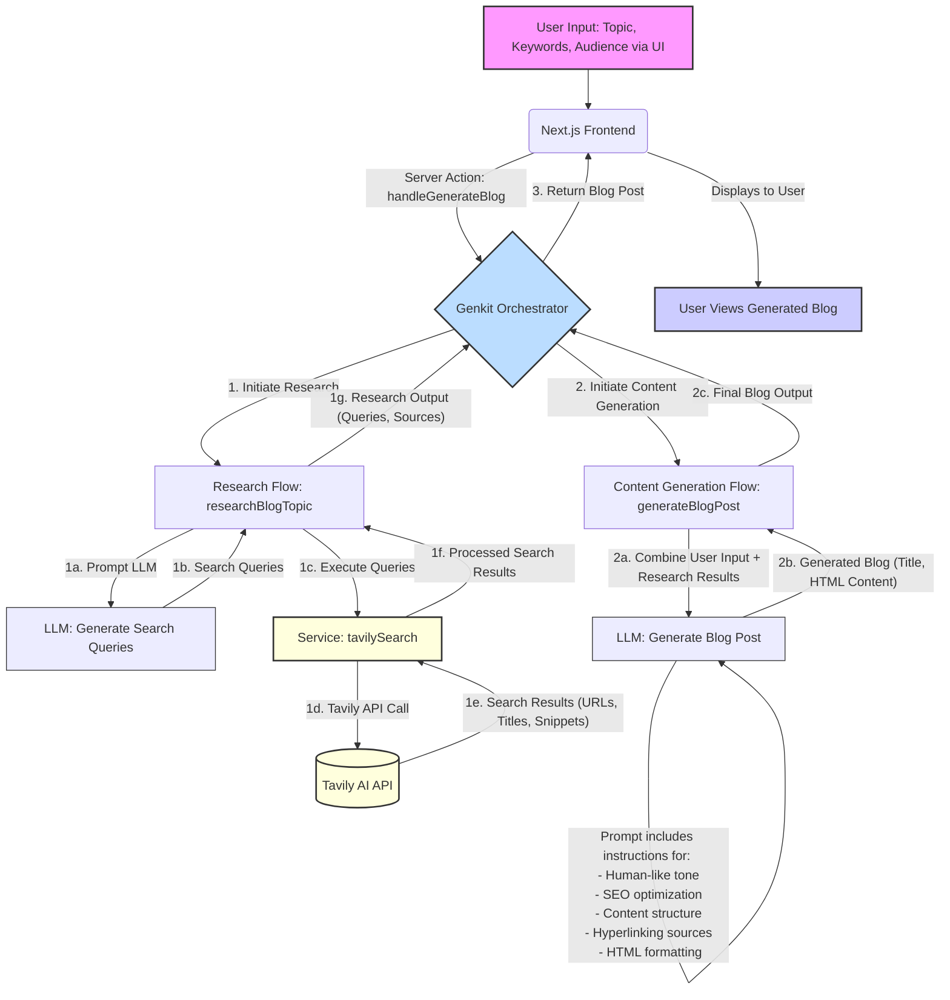

# BlogSmith AI 📝🤖

BlogSmith AI is a Next.js application that leverages the power of Google's Generative AI (via Genkit) and the Tavily API to create human-like, well-researched blog posts. It's designed to produce content that is not only engaging but also up-to-date and authentic, thanks to real-time web research and dynamic hyperlinking.

## ✨ Key Features

-   **AI-Powered Blog Generation**: Creates engaging blog posts from a simple description, keywords, and target audience.
-   **Real-time Web Research**: Utilizes the Tavily API to gather current information and relevant sources, ensuring content is timely and factual.
-   **Dynamic Hyperlinking**: Intelligently embeds relevant hyperlinks from research material directly into the generated blog content.
-   **SEO-Friendly Content**: The AI is prompted to generate content with SEO best practices in mind, aiming for better discoverability.
-   **Human-Like Writing Style**: Focuses on generating fluent, conversational, and engaging prose.
-   **Responsive & Modern UI**: Built with Next.js, React, Tailwind CSS, and ShadCN UI components for a clean user experience.
-   **Server-Side AI Logic with Genkit**: Employs Genkit for robust management of AI flows, model interactions, and tool usage.

## 🚀 Getting Started

Follow these instructions to get a copy of the project up and running on your local machine for development and testing purposes.

### Prerequisites

-   [Node.js](https://nodejs.org/) (v18.x or later recommended)
-   [npm](https://www.npmjs.com/) or [yarn](https://yarnpkg.com/)
-   A **Google API Key** with access to a Gemini model (e.g., Gemini 1.5 Flash) via Google AI Studio or Vertex AI.
-   A **Tavily API Key** from [Tavily AI](https://tavily.com/) for the web research capabilities.

### Environment Variables

Create a `.env` file in the root of your project and populate it with your API keys:

```env
# Required for Genkit to connect to Google AI models (e.g., Gemini)
GOOGLE_API_KEY=your_google_api_key_here

# Required for the Tavily search service to fetch research material
TAVILY_API_KEY=your_tavily_api_key_here

# Optional: Specify a specific Google Cloud project for Genkit if needed
# GCLOUD_PROJECT=your_gcloud_project_id
```

-   `GOOGLE_API_KEY`: Your API key for Google AI services (Gemini).
-   `TAVILY_API_KEY`: Your API key for the Tavily search service.

### Installation

1.  **Clone the repository:**
    ```bash
    git clone <repository-url>
    cd blogsmith-ai # Or your repository name
    ```

2.  **Install dependencies:**
    Using npm:
    ```bash
    npm install
    ```
    Or using yarn:
    ```bash
    yarn install
    ```

## ධ Running the Application

### Development Mode

To run the application in development mode, you need to start both the Next.js frontend and the Genkit development server (which hosts your AI flows).

1.  **Start the Genkit development server:**
    Open a terminal and run:
    ```bash
    npm run genkit:watch
    ```
    This command uses `tsx` to transpile and run your TypeScript AI flows and Genkit configuration. The `--watch` flag enables auto-reloading when you make changes to files in `src/ai/`. This will typically start the Genkit development UI on `http://localhost:4000`, where you can inspect and test your flows.

2.  **Start the Next.js development server:**
    Open another terminal and run:
    ```bash
    npm run dev
    ```
    This will start the Next.js application, usually on `http://localhost:9002` (as configured in `package.json`).

You can now access BlogSmith AI in your browser at `http://localhost:9002`.

### Production Build

To build the application for production:

```bash
npm run build
```

This command transpiles your AI flows and creates an optimized Next.js production build in the `.next` folder.

### Starting the Production Server

After building, you can start the production server:

```bash
npm run start
```

This will serve the optimized application, typically on `http://localhost:3000` (or the port specified by the `PORT` environment variable).
**Important for Production Deployment:** In a true production environment, Genkit flows are typically deployed as separate, scalable services (e.g., Google Cloud Functions, Cloud Run) that your Next.js backend would call via HTTP requests. The `genkit:watch` script is for local development convenience. For production, your build process should ensure the AI flows are correctly packaged or deployed, and your Next.js application should be configured to call these deployed flow endpoints.

## ⚙️ How BlogSmith AI Works: The Generation Pipeline

BlogSmith AI employs a multi-step process orchestrated by Genkit to generate high-quality blog posts. Here's a breakdown of the workflow:



**Step-by-Step Explanation:**

1.  **User Input**: The user provides a blog description, primary keywords, optional secondary keywords, and the target audience through the web interface.
2.  **Frontend Request**: The Next.js frontend captures this input and sends it to a Server Action (`handleGenerateBlog`).
3.  **Genkit Orchestration**: The Server Action invokes the main Genkit flow, `generateBlogPostFlow`.
4.  **Research Phase (`researchBlogTopic` flow):**
    *   **Query Generation**: The `generateBlogPostFlow` first calls the `researchBlogTopic` flow. This sub-flow uses an LLM (via `researchBlogTopicPrompt`) to intelligently generate a set of 2-3 relevant search queries based on the user's input. This step ensures that the subsequent web search is targeted and effective.
    *   **Web Search**: The generated search queries are then passed to the `tavilySearch` service. This service makes API calls to the Tavily API, requesting advanced search results (including content snippets).
    *   **Source Collection**: Tavily returns a list of relevant web pages, including their titles, URLs, and content snippets. The `researchBlogTopic` flow collects and de-duplicates these sources.
    *   **Research Output**: This flow returns the original search queries and a list of unique, relevant `TavilySearchResult` objects (containing title, URL, content snippet, and score) to the main `generateBlogPostFlow`.
5.  **Content Generation Phase (`generateBlogPostPrompt` within `generateBlogPostFlow`):**
    *   **Prompt Engineering**: The `generateBlogPostFlow` now prepares a detailed prompt for the primary LLM. This prompt includes:
        *   The original user input (description, keywords, audience).
        *   The curated "Research Material" (the `searchResults` array from the research phase).
        *   Specific instructions on how to write the blog post:
            *   **Tone & Style**: Human-like, fluent, conversational, and authoritative, tailored to the target audience.
            *   **Content Integration**: Critically use and synthesize information from the provided "Research Material". Prioritize these sources for facts and recent developments.
            *   **Structure & Length**: Logical flow, clear introduction, body paragraphs with headings (H2, H3), and a conclusion. Aim for 500-800 words.
            *   **Hyperlinking**: Naturally embed 2-3 relevant hyperlinks to the source URLs from the "Research Material". Use source titles or relevant phrases as anchor text. This is crucial for authenticity and providing references.
            *   **Formatting**: Output valid HTML (paragraphs, headings, lists). Exclude `<html>`, `<body>`, etc. No `` tags.
            *   **SEO**: Implied through keyword usage and good structure.
            *   **Originality**: Summarize, synthesize, and cite by linking; do not plagiarize.
    *   **LLM Invocation**: The prompt is sent to the configured Gemini model via Genkit.
    *   **Blog Output**: The LLM generates the blog post title and its content in HTML format.
6.  **Response to Frontend**: The generated title and HTML content are returned by the Server Action to the Next.js frontend.
7.  **Display to User**: The frontend component (`BlogDisplay`) renders the HTML content, showcasing the AI-generated blog post with its research-backed information and embedded hyperlinks.

This structured, multi-flow approach allows BlogSmith AI to first gather relevant, up-to-date information and then use that information to craft a high-quality, authentic, and well-referenced blog post, significantly enhancing the "human-like" and "well-researched" qualities of the output.

## 🛠️ Key Technologies Used

-   **[Next.js](https://nextjs.org/)**: React framework for server-side rendering, static site generation, and a full-stack development experience.
-   **[React](https://reactjs.org/)**: JavaScript library for building user interfaces.
-   **[TypeScript](https://www.typescriptlang.org/)**: Superset of JavaScript that adds static typing, improving code quality and maintainability.
-   **[Tailwind CSS](https://tailwindcss.com/)**: Utility-first CSS framework for rapid UI development and consistent styling.
-   **[ShadCN UI](https://ui.shadcn.com/)**: Collection of re-usable UI components built with Radix UI and Tailwind CSS, providing a professional look and feel.
-   **[Genkit](https://firebase.google.com/docs/genkit)**: An open-source framework from Google for building AI-powered applications. It's used here for:
    -   Defining and orchestrating multi-step AI flows.
    -   Managing interactions with Large Language Models (LLMs).
    -   Integrating AI tools (like custom search functions).
    -   **[@genkit-ai/googleai](https://www.npmjs.com/package/@genkit-ai/googleai)**: Genkit plugin for integrating Google AI models (like Gemini).
-   **[Tavily API](https://tavily.com/)**: A specialized search API designed for LLMs, providing real-time, accurate, and relevant web research results.
-   **[Zod](https://zod.dev/)**: TypeScript-first schema declaration and validation library, used to ensure type safety for AI flow inputs and outputs.
-   **[Lucide React](https://lucide.dev/)**: A comprehensive library of simply beautiful open-source icons.
-   **[React Hook Form](https://react-hook-form.com/)**: Performant, flexible, and extensible forms with easy-to-use validation.

## 📂 Project Structure

The project follows a standard Next.js App Router structure with clear separation of concerns:

```
.
├── public/                 # Static assets (images, fonts, etc.)
├── src/
│   ├── ai/                 # Core AI logic managed by Genkit
│   │   ├── dev.ts          # Entry point for Genkit development server (genkit start)
│   │   ├── flows/          # Genkit flow definitions
│   │   │   ├── generate-blog-post.ts  # Main blog generation flow
│   │   │   ├── research-blog-topic.ts # Flow for web research using Tavily
│   │   │   └── summarize-user-feedback.ts # (Optional) Flow for processing feedback
│   │   ├── genkit.ts       # Global Genkit instance and plugin configuration (e.g., GoogleAI)
│   │   └── types.ts        # Shared Zod schemas and TypeScript types for AI flows
│   ├── app/                # Next.js App Router: pages, layouts, server actions
│   │   ├── page.tsx        # Main application page (/)
│   │   ├── actions.ts      # Server Actions for form submissions and AI flow invocations
│   │   ├── globals.css     # Global styles, Tailwind CSS base, and ShadCN UI theme variables
│   │   └── layout.tsx      # Root layout for the application
│   ├── components/         # React components
│   │   ├── ui/             # ShadCN UI components (Button, Card, Input, etc.)
│   │   ├── blog-display.tsx# Component to render the generated blog content
│   │   └── blog-form.tsx   # Form component for user input (topic, keywords, etc.)
│   ├── hooks/              # Custom React hooks (e.g., useToast for notifications)
│   ├── lib/                # Utility functions (e.g., cn for classnames)
│   └── services/           # Modules for interacting with external APIs
│       └── tavily.ts       # Service for making calls to the Tavily Search API
├── .env                    # Local environment variables (API Keys) - Not committed
├── .env.example            # Example environment variables file
├── components.json         # ShadCN UI configuration
├── next.config.ts          # Next.js configuration
├── package.json            # Project dependencies and scripts
├── tailwind.config.ts      # Tailwind CSS configuration
└── tsconfig.json           # TypeScript configuration
```

## 🤖 AI / Genkit Integration Details

The heart of BlogSmith AI's intelligence lies in its Genkit integration:

-   **`src/ai/genkit.ts`**: This file initializes the global Genkit `ai` object. It configures the necessary plugins, most importantly the `googleAI()` plugin, which allows Genkit to communicate with Google's Gemini models. The default model (e.g., `gemini-2.0-flash`) is also set here.
-   **`src/ai/flows/`**: This directory houses the individual Genkit flows.
    -   **`research-blog-topic.ts`**:
        -   Defines the `researchBlogTopicFlow`.
        -   Takes `ResearchBlogTopicInput` (blog description, keywords, audience).
        -   Uses `researchBlogTopicPrompt` to ask an LLM to generate relevant search queries.
        -   Calls the `tavilySearch` service (from `src/services/tavily.ts`) with these queries.
        -   Returns `ResearchBlogTopicOutput` (the queries used and an array of `TavilySearchResult` objects containing titles, URLs, and content snippets).
    -   **`generate-blog-post.ts`**:
        -   Defines the `generateBlogPostFlow`.
        -   Takes `GenerateBlogPostInput` (user's initial request).
        -   First, it calls `researchBlogTopic` to get up-to-date research material.
        -   It then constructs `GenerateBlogPostPromptInputSchema` by combining the user's input with the `searchResults` from the research step.
        -   The `generateBlogPostPrompt` is heavily engineered. It instructs the LLM on style, tone, length, SEO considerations, HTML formatting, and crucially, how to **integrate the research material and embed hyperlinks** to the actual source URLs.
        -   Returns `GenerateBlogPostOutput` (blog title and HTML content).
-   **`src/ai/types.ts`**: Contains Zod schemas for defining the expected structure and types for inputs and outputs of all AI flows and prompts. This ensures data integrity and provides strong typing throughout the AI logic. Schemas like `GenerateBlogPostInputSchema`, `TavilySearchResultSchema`, and `GenerateBlogPostOutputSchema` are critical here.
-   **Server Actions (`src/app/actions.ts`)**: The Next.js frontend interacts with these Genkit flows via Server Actions. For instance, `handleGenerateBlog` is a server action that takes validated form data, calls the `generateBlogPostFlow`, and returns the result to the client.

## 🌐 External Services

-   **Tavily AI (`src/services/tavily.ts`)**: This module encapsulates the logic for interacting with the Tavily Search API. The `tavilySearch` function:
    -   Takes a search query and maximum number of results.
    -   Constructs the API request to Tavily, including the API key.
    -   Specifies parameters like `search_depth: 'advanced'` to get comprehensive results and `include_raw_content: false` (as `content` snippets are usually sufficient and more concise).
    -   Handles API responses, including potential errors.
    -   Transforms the Tavily API response into an array of `TavilySearchResult` objects, which is a standardized format used within the application.

## Linting and Type Checking

-   **ESLint**: Configured for code linting. Run `npm run lint` to check for linting errors and maintain code style.
-   **TypeScript**: Used for static type checking across the project. Run `npm run typecheck` to ensure type safety.

## 🎨 Styling and UI

-   **Tailwind CSS**: The primary styling engine, configured in `tailwind.config.ts`. Utility classes are used extensively for rapid and consistent UI development.
-   **ShadCN UI Theme**: The application uses a custom theme for ShadCN UI components. This theme is defined using CSS HSL variables in `src/app/globals.css`. This allows for easy customization of the color palette (background, foreground, primary, accent, destructive, etc.) for both light and dark modes.
-   **Google Fonts (Geist)**: The `Geist Sans` and `Geist Mono` fonts are used for clean and modern typography, configured in `src/app/layout.tsx`.
-   **Responsive Design**: The UI is designed to be responsive and adapt to various screen sizes, leveraging Tailwind's responsive prefixes.

## 🚀 Deployment Considerations

To deploy this Next.js application effectively, consider the following:

-   **Platform Choice**:
    -   [Vercel](https://vercel.com/): Highly recommended for Next.js applications due to its seamless integration and optimization features.
    -   [Netlify](https://www.netlify.com/): Another excellent platform for modern web applications.
    -   [Google Cloud Run](https://cloud.google.com/run) / [Google Cloud Functions](https://cloud.google.com/functions): Suitable for deploying both the Next.js app and the Genkit flows as separate services.
    -   Self-hosting on a Node.js server or Docker container.
-   **Environment Variables**: Ensure all necessary environment variables (`GOOGLE_API_KEY`, `TAVILY_API_KEY`) are securely configured in your deployment environment's settings. Do NOT commit your `.env` file.
-   **Genkit Flow Deployment (Production)**:
    -   For production, Genkit flows should ideally be deployed as independent, callable HTTP endpoints (e.g., as Firebase Cloud Functions or Google Cloud Run services).
    -   Your Next.js application's Server Actions would then make authenticated HTTP requests to these deployed flow endpoints instead of calling them directly as local TypeScript functions. This decouples the AI backend from the frontend and allows for independent scaling.
    -   The `genkit deploy` command can assist in deploying flows to supported platforms.
-   **Build Process**: Your deployment pipeline should include `npm run build` to create an optimized Next.js build. If deploying Genkit flows separately, ensure they are also built and deployed.
-   **Database (Optional for Future Extensions)**: If you plan to store generated blogs, user feedback, or other data, you'll need to integrate a database (e.g., Firebase Firestore, Supabase, PostgreSQL).

## 🤝 Contributing

Contributions are highly welcome! If you have suggestions, find bugs, or want to improve the application, please:

1.  Fork the repository.
2.  Create a new branch for your feature or fix (`git checkout -b feature/your-amazing-feature` or `fix/issue-description`).
3.  Make your changes, adhering to the coding style and best practices.
4.  Commit your changes with clear, descriptive messages (`git commit -m 'feat: Add X feature that does Y'`).
5.  Push your branch to your fork (`git push origin feature/your-amazing-feature`).
6.  Open a Pull Request against the main repository, detailing your changes.

Please ensure your code passes linting (`npm run lint`) and type checks (`npm run typecheck`) before submitting a PR.

## 📄 License

This project is licensed under the [MIT License](LICENSE.md) (Create a LICENSE.md file if one doesn't exist, typically with MIT content).

---

Happy Blogging with AI! 🎉